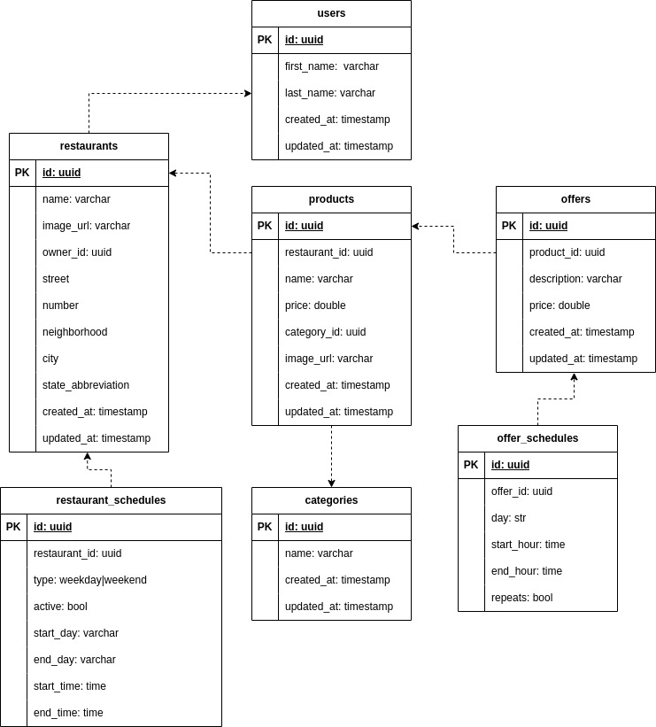

# RaFood API

FastAPI project to manage restaurants, products and offers :hamburger:

## About the project

It was based on [this](https://github.com/goomerdev/job-dev-backend-interview) backend challenge and a opportunity to learn and apply some concepts of FastAPI

### Tools used :hammer:

- Python (3.10)
- Poetry
- FastAPI
- Pydantic
- SQLAlchemy
- Alembic
- Pre-commit
- PostgreSQL
- Docker & Docker Compose

### ER Model



### Swagger

FastAPI generates an OpenAPI docs on `/docs` endpoint.

### Contexts

Based on the ER Model there are 5 folder to separate contexts:
- Restaurants and restaurant schedules
- Products
- Offers and offers schedules
- Categories
- Users

## Running the API :running:

To install the app:

```bash
poetry install
```

To run poetry shell:

```bash
make shell
```

To run the API:

```bash
make run
```

### Start dependencies

To start and stop the Docker dependencies:

```bash
make dep-start

make dep-stop
```

### Alembic migrations

To create a new revision (migration file based on the models definitions):

```bash
make create-migration name=<revision-name>
```

To migrate or rollback

```bash
make migrate

make rollback
```

### Linter

The `pre-commit` is enable to run linter before each commit, but you can run any time. To run linter manually:

```bash
make lint
```


### Tests

:hourglass: **To be defined**

---

### :white_check_mark: Major technical TODOs

 - [X] Query params on lists endpoints
 - [ ] Improve body data validation
 - [X] Return all relations correctly on 'get by ID' endpoints
 - [ ] Refactor to use services and core classes
 - [ ] Fix on error on alembic `env.py` file
 - [ ] Add tests for all endpoints and contracts
 - [ ] Improve exception handling errors
 - [ ] Improve logging
 - [ ] Solve minor TODOs
 - [X] Write README docs

---

Made with :crystal_ball: for studies by RafaelEmery
