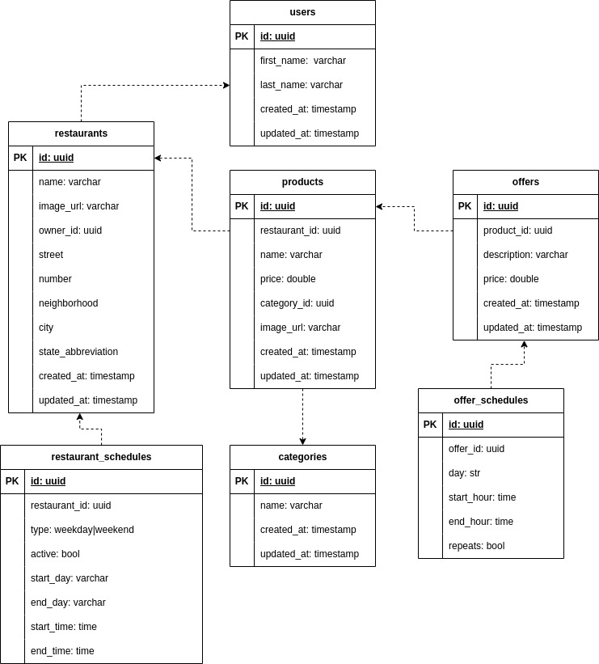

# RaFood API

FastAPI project to manage restaurants, products and offers :hamburger:

## Table of Contents

- [RaFood API](#rafood-api)
  - [Table of Contents](#table-of-contents)
  - [About the project](#about-the-project)
    - [Tools used :hammer:](#tools-used-hammer)
    - [ER Model](#er-model)
    - [Contexts](#contexts)
    - [Architecture Decision Records (ADRs)](#architecture-decision-records-adrs)
    - [Swagger](#swagger)
    - [Monitoring](#monitoring)
  - [Running the API :running:](#running-the-api-running)
    - [Alembic migrations](#alembic-migrations)
    - [Linter](#linter)
    - [Tests](#tests)
    - [Load Tests](#load-tests)
  - [Creating a new release](#creating-a-new-release)

## About the project

It was based on [this](https://github.com/goomerdev/job-dev-backend-interview) backend challenge and a opportunity to learn and apply some concepts of FastAPI.

My inicial studies of FastAPI is at [fastapi-studies repository](https://github.com/RafaelEmery/fastapi-studies)

### Tools used :hammer:

- Python (`3.10.7`)
- Poetry
- FastAPI
- SQLModel & Alembic
- Pytest
- PostgreSQL
- Docker & Docker Compose
- Prometheus & Grafana
- Locust
- GitHub Actions

### ER Model



### Contexts

Based on the ER Model there are 5 folder to separate contexts:

- Restaurants and restaurant schedules
- Products
- Offers and offers schedules
- Categories
- Users

### Architecture Decision Records (ADRs)

The ADRs are at `adr/` [folder and documents the main decisions](./adr/README.md) of this project.

### Swagger

FastAPI generates an OpenAPI docs on `/docs` endpoint.

### Monitoring

More about monitoring setup can be found at [docs/monitoring.md](./docs/monitoring.md).

## Running the API :running:

To show all Makefile commands:

```bash
make help
```

To install Python and Pyenv:

```bash
pyenv install 3.10.7

pyenv virtualenv 3.10.7 rafood-api

pyenv activate rafood-api
```

To install the application:

```bash
make build
```

To run the API and dependencies with Docker:

```bash
make start
```

To stop the API and dependencies:

```bash
make stop
```

You can also use `restart` and `build` commands.

To check API logs:

```bash
make logs
```

### Alembic migrations

To create a new revision (migration file based on the models definitions):

```bash
make create-migration name=<revision-name>
```

To migrate or rollback

```bash
make migrate

make rollback
```

### Linter

The `pre-commit` is enable to run linter before each commit, but you can run any time. To run linter manually:

```bash
make lint
```

### Tests

To run tests with `pytest`:

```bash
make test
```

Be sure to have database container running with `make start`

### Load Tests

To run load tests with `locust`:

```bash
make load-test
```

More about load tests can be found at [docs/load-testing.md](./docs/load-testing.md).

## Creating a new release

More about the release process and GitHub Actions workflows can be found at [docs/workflows.md](./docs/workflows.md) on `Creating Releases` section.

______________________________________________________________________

Made for studies by RafaelEmery
