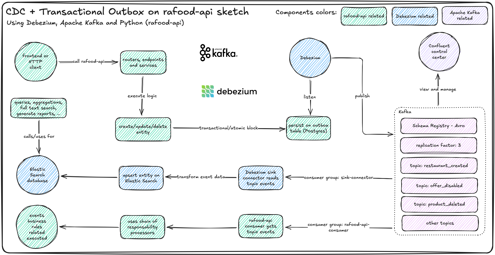

# Add CDC and Transactional Outbox with Kafka

## Context

Apache Kafka is a distributed streaming platform that allows us to publish and subscribe to streams of records, similar to a message queue. In Kafka we have topics, partitions, brokers, consumers and producers.

The transactional outbox pattern publishes events reliably by writing the
domain change and an outbox row in the same database transaction. A separate
process (here, CDC via Debezium) reads the outbox and publishes to Kafka, so
a rollback never leaves a half-published event.

The CDC (Change Data Capture) pattern is a pattern that allows us to capture the changes in a database and publish them to a message queue. We can use a tool like Debezium to capture the changes in a database and publish them to a Kafka topic.

Debezium is primarily a set of Kafka Connect *source* connectors: they capture changes from databases (PostgreSQL, MySQL, MongoDB, Oracle, etc.) and publish them to Kafka. *Sink* connectors do the opposite—consume from Kafka and write to a destination (e.g. Elasticsearch via an Elasticsearch Sink Connector).

## Decision

We need to add Apache Kafka to the project to handle the messaging between the services.

Along with Kafka, we'll use the transactional outbox pattern to handle the events publishing with CDC (Change Data Capture) to publish the events to Kafka.

Kafka events will be published using Schema Registry (Apache Avro) to ensure the events are compatible with the Kafka topics and will be consumed by two consumer groups: the application itself and the Elasticsearch Sink Connector.

### Sketch

### Transactional Outbox

Persist domain create/update/delete and an outbox row in the same Postgres transaction. The API never produces to Kafka directly; CDC reads the outbox after commit.

### Kafka Connect and Debezium

Run Kafka Connect with a Debezium Postgres source connector on the outbox table to publish changes to Kafka. Run an Elasticsearch sink connector to transform events and upsert into Elasticsearch. Optionally, a rafood-api consumer applies business rules from the same topics.

### Apache Kafka and Schema Registry

Run Kafka, Schema Registry (Avro), and Confluent Control Center with Docker. Define domain topics (e.g. `restaurant_created`, `offer_disabled`, `product_deleted`) and manage brokers, topics, schemas, and connectors via Control Center.

## Consequences

- Domain writes and event publishing stay atomic via the outbox; no dual-write races with Kafka.
- Event schemas are versioned and validated (Avro + Schema Registry), reducing breaking consumer changes.
- Elasticsearch can be kept eventually consistent for search/reporting without coupling the API write path to ES.
- Local/dev and ops surface grow: Kafka, Connect, Schema Registry, Control Center, and Elasticsearch via Docker.
- Outbox retention, connector lag, schema evolution, and at-least-once delivery (idempotent consumers) become ongoing concerns.
- Failure modes shift: DB/outbox health and Connect pipeline health matter as much as the API process itself.

## References

- Full Cycle 4.0 - Apache Kafka course

> This ADR is a PoC (Proof of Concept) for Apache Kafka course from Full Cycle and implements some of the concepts and patterns described in the course. The transactional outbox pattern and Elastic Search usage are based on my professional experience.
