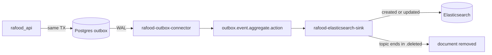

# Elasticsearch sink connector

Infrastructure only. No Python, no migration, no ADR edit. Smoke stays unchanged (no HTTP API change). `make agent-checks` is not needed.

The design doc goes in [docs/feature-prompts/kafka-and-elastic-search/plans/add-elastic-search-sink-connector.md](docs/feature-prompts/kafka-and-elastic-search/plans/add-elastic-search-sink-connector.md), same role as [docs/feature-prompts/kafka-transactional-outbox-and-cdc/plans/add-kafka-and-debezium.md](docs/feature-prompts/kafka-transactional-outbox-and-cdc/plans/add-kafka-and-debezium.md).

## Flow



Today only product events are written (`product.created` / `updated` / `deleted` in [src/products/outbox_events.py](src/products/outbox_events.py)). The sink does not special-case product: `topics.regex` is `outbox\.event\..*`, and RegexRouter maps `outbox.event.<aggregate>.<action>` to index `<aggregate>`. Document id is the Kafka key (`aggregateid`). `write.method=upsert` overwrites that id, so created and updated land on the same product document.

A topic ending in `.deleted` removes that document, so it no longer shows up in search. The Kafka event stays a full snapshot. Only the sink turns it into a tombstone, before RegexRouter renames the topic:

- Predicate `TopicNameMatches` on `outbox\.event\..+\.deleted`.
- `io.confluent.connect.transforms.Drop$Value` (Confluent Drop SMT, not in the base image) nulls the value. Default `schema.behavior=nullify`.
- `behavior.on.null.values=delete` sends a delete for that key. `key.ignore` stays `false`.

Drop runs before RegexRouter. After the rename the topic is only `product`, and the predicate would miss `.deleted`.

Same rule for every aggregate once its topics exist and that domain writes the outbox. No change to the outbox payload. This change does not create restaurant topics and does not emit restaurant outbox rows.

A later `updated` on its own topic can upsert the document back. Kafka does not order across topics. That limit stays as-is.

The worker already deserializes Avro (`CONNECT_VALUE_CONVERTER` + Schema Registry in [docker/docker-compose.yml](docker/docker-compose.yml)). The sink JSON does not repeat converters. Connect names the sink consumer group `connect-rafood-elasticsearch-sink` from the connector name.

## Changes

- [docker/docker-compose.yml](docker/docker-compose.yml): `elasticsearch` on profile `kafka`, image `8.15.3`, security off, heap `512m`, port `9200`, volume `elasticsearch_data`, healthcheck from the prompt. Add `elasticsearch: condition: service_healthy` to `kafka-setup.depends_on`.
- [docker/kafka-connect/Dockerfile](docker/kafka-connect/Dockerfile): pin `ELASTICSEARCH_SINK_VERSION=14.1.0` and `confluent-hub install confluentinc/kafka-connect-elasticsearch`. Also pin `confluentinc/connect-transforms` (the Drop SMT; Hub release that supports Confluent Platform 7.8, not `latest`). Same pattern as the Debezium plugin. `make start-kafka` already passes `--build`; `make restart-kafka` does not, so a plugin change needs `make start-kafka`.
- [docker/kafka/connectors/elastic-search-sink-connector.json](docker/kafka/connectors/elastic-search-sink-connector.json): the prompt JSON, plus `behavior.on.null.values=delete`, the delete predicate, and `Drop$Value` before RegexRouter.
- [docker/kafka/setup.sh](docker/kafka/setup.sh): keep only the product topics. After the outbox source is registered, `wait_for_elasticsearch` then `PUT /connectors/rafood-elasticsearch-sink/config` (idempotent, same as the source). A later aggregate is added to `TOPICS` when that domain starts writing the outbox; `topics.regex` already matches it.
- Docs: extend [docker/kafka/connectors/README.md](docker/kafka/connectors/README.md) with the sink properties, the consumer-group name, how `.deleted` removes the document, and the curl checks. Add a short Elasticsearch section to [docs/kafka-events-guide.md](docs/kafka-events-guide.md). Mention `elasticsearch` in the kafka-profile row of [.cursor/rules/docker-compose.mdc](.cursor/rules/docker-compose.mdc) and in the `start-kafka` help line in [Makefile](Makefile).

## Verify (you run this)

`make start-kafka` rebuilds Connect and starts the profile. Then:

```bash
curl -s localhost:8083/connectors/rafood-elasticsearch-sink/status
curl -s localhost:9200/product/_doc/<uuid>
curl -s 'localhost:9200/product/_search?q=hamburguer'
```

After a product delete, `/product/_doc/<uuid>` is `found: false` and the search no longer returns it. A later aggregate is indexed the same way once its topics exist and the outbox writes them.

References: [Confluent Elasticsearch Sink](https://docs.confluent.io/kafka-connect-elasticsearch/current/), [Kafka Connect REST API](https://docs.confluent.io/platform/current/connect/references/restapi.html), ADR 009.
