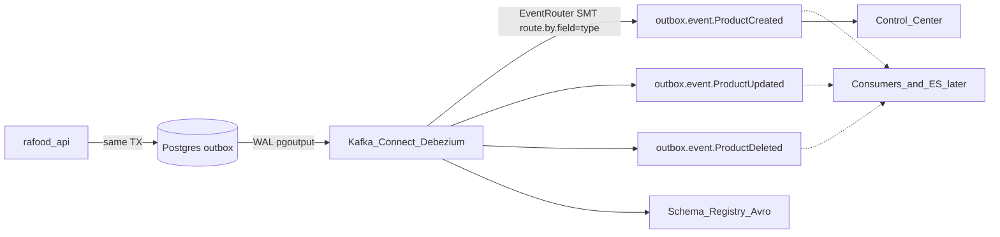
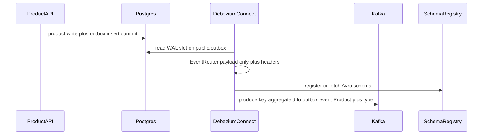

# Add Kafka and Debezium (CDC on outbox)

## Goal

Wire CDC on top of the **already implemented** transactional outbox. The API still does **not** produce to Kafka. Debezium (Postgres source connector + Outbox Event Router SMT) reads `public.outbox` and publishes to Kafka. Consumers and Elasticsearch upsert stay **out of scope**.

## Locked decisions

**Stack (local Docker only, not Kubernetes)**

- Compose profile: `kafka` (same idea as `monitoring`).
- Pin **Confluent Platform 7.8.0** (KRaft, classic Control Center in one container). CP 8 splits Control Center behind Prometheus/Alertmanager — extra complexity not asked for.
- Skip ksqlDB, REST Proxy, and Datagen.
- Images: `confluentinc/cp-kafka:7.8.0`, `cp-schema-registry:7.8.0`, `cp-enterprise-control-center:7.8.0`, custom Connect image based on `cp-kafka-connect:7.8.0` with the Debezium Postgres connector installed via `confluent-hub`.

**Cluster: single broker, RF = 1**

One KRaft broker (combined broker+controller), replication factor **1**, `min.insync.replicas` **1** — chosen deliberately to keep the local setup light.

This is a **conscious deviation** from the prompt's "more than one replica": RF cannot exceed the broker count, so RF>1 would require 3 brokers and roughly 8-12 GB of Docker RAM. The deviation is recorded in `docker/kafka/connectors/README.md`, including what to change to grow to RF=3.

`make start` does **not** start this profile.

**Three topics, one per event type**

Route by the outbox `type` column instead of `aggregatetype`, so each event type gets its own topic. This matches the illustrative topic style in ADR 009 (`restaurant_created`, `offer_disabled`, `product_deleted`).

- `transforms.outbox.route.by.field=type` + default `route.topic.replacement=outbox.event.${routedByValue}`
- Topics: `outbox.event.ProductCreated`, `outbox.event.ProductUpdated`, `outbox.event.ProductDeleted` (values come from `ProductOutboxEvent` in `src/products/outbox_events.py`; no `src/` change). A `RegexRouter` SMT after the EventRouter can rename them to snake_case later without touching Python.
- Partitions: **3** each (the prompt's "more than one partition"; fine on a single broker)
- Replication factor: **1**
- `cleanup.policy=delete` on all three
- Kafka key: `aggregateid` (product UUID) — within each topic, one product always lands on the same partition
- Headers: `id` (outbox UUID, consumer dedup later), `eventType` (redundant here, since the topic already encodes it, but the SMT emits it anyway)
- Value: **Product schema only** (Event Router strips the Debezium `before` / `after` / `source` / `op` envelope — this is the "only with after" requirement)

**Ordering consequence, accepted on purpose.** Kafka orders messages per partition, and there is no ordering across topics. Per product, order holds *within* a type (two updates arrive in order), but **not between types**: a consumer reading the three topics can see `ProductDeleted` before the `ProductUpdated` that preceded it in the database.

Mitigation for the later consumers / Elasticsearch sink (out of scope now, noted in `docker/kafka/connectors/README.md`): the payload already carries `updated_at` from `ProductSchema`, so the sink can do a version-aware upsert (ignore a write whose `updated_at` is older than the stored one) and treat delete as terminal. Without that, cross-type races can resurrect a deleted product.

The three topics are created by a one-shot `kafka-setup` container in the profile, not by a Make target. Connect / Schema Registry / Control Center internal topics are created by those services with RF=1 (`CONNECT_*_STORAGE_REPLICATION_FACTOR`, `CONTROL_CENTER_REPLICATION_FACTOR`, `KAFKA_OFFSETS_TOPIC_REPLICATION_FACTOR`, `KAFKA_TRANSACTION_STATE_LOG_*`), same values as the Confluent KRaft reference compose.

**Avro without changing the outbox table**

Outbox `payload` is already JSONB (`ProductSchema.model_dump`). Do **not** switch the column to `bytea` or serialize Avro in Python (that would pull Schema Registry into the API write path and need a new Poetry package).

- `transforms.outbox.table.expand.json.payload=true` — expand JSONB into a Connect struct (product fields)
- `value.converter=io.confluent.connect.avro.AvroConverter` + Schema Registry — Avro on the wire
- `key.converter=StringConverter` — UUID key for partitioning

Official SMT docs use JsonConverter in the JSON example; AvroConverter is the same Connect schema path and matches ADR 009 and the "Uses Avro for schema registry" requirement.

**Idempotent, ordered production**

- Order: key = `aggregateid`, so per-product order is preserved inside each topic (not across the three — see the ordering consequence above).
- Idempotent produce: Connect worker `enable.idempotence=true`, `acks=all`, `max.in.flight.requests.per.connection=5`. With RF=1, `acks=all` means the ack comes from the single leader — idempotence still dedups producer retries, but there is no replica durability.
- At-least-once CDC remains; consumer idempotency later uses header `id`. No API-side Kafka client.

**Postgres (always-on `database` service)**

Debezium needs logical decoding even when the kafka profile is down, so the existing `database` service changes:

- `postgres -c wal_level=logical -c max_wal_senders=10 -c max_replication_slots=10`
- Healthcheck with `pg_isready`
- Existing volume: **restart/recreate the container is enough**; do not wipe data. The `wal_level` change applies on restart.

Connector: `plugin.name=pgoutput`, `publication.autocreate.mode=filtered`, `table.include.list=public.outbox`, `slot.name=debezium_outbox`, `publication.name=dbz_outbox`, `topic.prefix=rafood`, `snapshot.mode=initial`, `tombstones.on.delete=false`, heartbeat interval to avoid WAL bloat.

Existing `DB_USER` (Compose superuser) is reused for the PoC; no new DB role or migration.

## Architecture





## Inline comments (learning aid)

Every new or changed infra file gets **short English comments** above or beside the relevant settings, explaining *why* the value matters — not restating the key name. Target the non-obvious knobs (listeners, converters, replication factors, WAL settings, SMT options), skip the self-evident ones (`container_name`, `ports`).

- `docker-compose.yml`: comments on the KRaft listener pair (`KAFKA_LISTENERS` vs `KAFKA_ADVERTISED_LISTENERS`, and why in-container clients use `kafka:29092` while the host uses `localhost:9092`), `CLUSTER_ID`, the RF=1 internal-topic vars, Connect converters and `CONNECT_PLUGIN_PATH`, Control Center wiring, and the Postgres `wal_level=logical` command.
- `docker/kafka-connect/Dockerfile`: why the Debezium plugin must be baked in, and why the version is pinned.
- `docker/kafka/setup.sh`: comments on each step and on the flags that carry meaning (`--if-not-exists`, `--partitions`, `--replication-factor`, why `PUT .../config` instead of `POST /connectors`, why the readiness loops exist).
- `.env.example`: one line per new port var, matching the existing style in that file.

**Connector JSON is the exception.** `docker/kafka/connectors/outbox-source.json` is posted to the Connect REST API, which rejects comments (strict JSON), so it stays comment-free. Its annotated walkthrough lives in the sibling `docker/kafka/connectors/README.md` as a property-by-property list, each with one sentence on what breaks without it.

No conflict with `.cursor/rules/code-design.mdc` ("no redundant comments"): that rule targets Python application code, and this change touches no `src/` file.

## Files to add / change

| File                                         | Action                                                                                |
| -------------------------------------------- | ------------------------------------------------------------------------------------- |
| `docker-compose.yml`                         | `kafka` profile services; Postgres `command` + healthcheck on `database`              |
| `docker/kafka-connect/Dockerfile`            | `cp-kafka-connect:7.8.0` + pinned Debezium Postgres connector (confluent-hub)         |
| `docker/kafka/connectors/outbox-source.json` | Debezium source + EventRouter SMT + Avro converter                                    |
| `docker/kafka/connectors/README.md`          | Reference doc next to the connector JSON                                              |
| `docker/kafka/setup.sh`                      | One-shot: wait for broker, create the three topics, wait for Connect, `PUT` connector |
| `Makefile`                                   | `start-kafka`, `down-kafka`, `restart-kafka` only. No topic/connector target          |
| `.env.example`                               | Host ports: Kafka 9092, Schema Registry 8081, Connect 8083, Control Center 9021       |
| `.cursor/rules/docker-compose.mdc`           | List the `kafka` profile in the services table                                        |

**Nothing is added to `docs/`** other than this plan file. No `docs/kafka.md`, no edit to `docs/README.md`. Day-to-day usage needs no separate guide: the `## ` help strings on the new Make targets surface in `make help`, matching how `start-monitoring` is documented today.

**Do not change:** `src/` (outbox/products already correct), Alembic, Kubernetes/Helm, ADRs, Poetry.

**Smoke:** skipped — public HTTP contract unchanged.

**Tests:** no pytest (infra-only).

## Setup on startup (no Make target)

Topic creation and connector registration happen in a **one-shot container inside the `kafka` profile**, so bringing the stack up is the only step a human takes.

```yaml
kafka-setup:
  image: confluentinc/cp-kafka:7.8.0
  profiles: ["kafka"]
  restart: "no"
  depends_on:
    kafka: { condition: service_healthy }
    connect: { condition: service_healthy }
  volumes:
    - ./docker/kafka:/setup:ro
  entrypoint: ["bash", "/setup/setup.sh"]
```

- The broker gets a healthcheck (`kafka-broker-api-versions`), Connect gets one on `GET /connectors`, so the script never races the cluster.
- The script is **idempotent**: `kafka-topics --create --if-not-exists` and `PUT /connectors/<name>/config`. It runs on every `up`, not only the first, and the container exits `0` when everything already exists.
- Compose keeps the exited container listed as `Exit 0`; `make start-kafka` output shows it, which is the intended signal that setup ran.

## Connector config (essentials)

- `connector.class=io.debezium.connector.postgresql.PostgresConnector`
- `database.hostname=database`, credentials rendered from Compose env by `setup.sh`
- `transforms=outbox` + `io.debezium.transforms.outbox.EventRouter`
- SMT predicate (`TopicNameMatches` on `rafood.public.outbox`) so heartbeats and transaction metadata are not routed as outbox events
- `table.expand.json.payload=true`
- `route.by.field=type` (three topics) + `route.topic.replacement=outbox.event.${routedByValue}` (default)

## Makefile / DX

```bash
make start-kafka    # compose --profile kafka up -d --build; kafka-setup creates topics + connector
make down-kafka
make restart-kafka
```

Control Center: `http://localhost:9021` (port from `.env`).

Manual check: create/update/delete a product via API, confirm a row in `outbox`, then one message on the matching topic (`outbox.event.ProductCreated` / `ProductUpdated` / `ProductDeleted`), Avro value = product fields, key = product UUID.

## Out of scope

- Kafka consumers in rafood-api
- Elasticsearch sink connector
- Other domains' outbox events
- Changing outbox schema or Product payload
- Applying migrations
- Kubernetes Kafka

## References

- [ADR 009](../../../adr/009-add-cdc-transactional-outbox-with-kafka.md)
- [Debezium Outbox Event Router](https://debezium.io/documentation/reference/stable/transformations/outbox-event-router.html)
- [Debezium PostgreSQL connector](https://debezium.io/documentation/reference/stable/connectors/postgresql.html)
- [Confluent cp-all-in-one KRaft 7.8.0](https://github.com/confluentinc/cp-all-in-one/blob/7.8.0-post/cp-all-in-one-kraft/docker-compose.yml)
- [Confluent Schema Registry](https://docs.confluent.io/platform/current/schema-registry/index.html)
- [Transactional Outbox](https://microservices.io/patterns/data/transactional-outbox.html)
