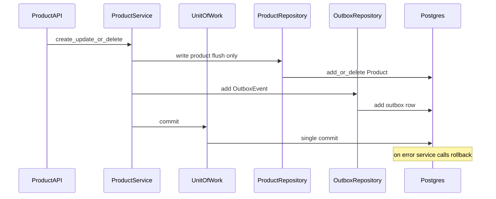

# Add Transactional Outbox (Product first) + Unit of Work

## Goal

Persist Product create/update/delete events in an `outbox` table in the **same** DB transaction as the domain write. CDC/Debezium (later) will publish to Kafka; the API does **not** produce to Kafka in this change.

**Transaction ownership:** `ProductService` orchestrates outbox enqueue and `UnitOfWork.commit()` / `rollback()`. Repositories only persist (`add` / `flush` / `delete`) — no `commit` in product writes.

## Scope vs other domains

**This change touches only products (+ shared core primitives).** Categories, restaurants, offers, and users keep the current “repository commits” pattern until a follow-up migrates them to UoW (without outbox events yet).

- Introducing `UnitOfWork` + `get_unit_of_work` in `core` does **not** break other domains (they simply do not use it yet).
- Changing only `ProductRepository` write methods to flush-only does **not** change other repositories.
- Shared `get_session` behavior stays: yield session, close in `finally`. No forced global commit/rollback middleware in this phase.

Later (out of scope here): migrate other domain repositories to flush-only + inject UoW into their services for the same commit style, still without outbox until each domain needs events.

## Placement: `src/core/outbox/` + `src/core/unit_of_work.py`

**Outbox** under `src/core/outbox/` — shared integration infrastructure, not a business domain (same rationale as `logging/`).

- `models.py` — `OutboxEvent`, `__tablename__ = 'outbox'`
- `repository.py` — `add` only (**no** `commit`)
- `events.py` — builders for `ProductCreated` / `ProductUpdated` / `ProductDeleted`
- `deps.py` — `get_outbox_repository(db)`

**Unit of Work** in `src/core/unit_of_work.py`:

- Wraps the request `AsyncSession`
- Exposes `commit()` / `rollback()`
- Wired via `get_unit_of_work(db: AsyncSession = Depends(get_session))` in core deps

Skip HTTP API for outbox.

## Outbox schema (locked)

Align with the [Debezium Outbox Event Router](https://debezium.io/documentation/reference/stable/transformations/outbox-event-router.html) default columns:

| Column          | Type           | Role                                            |
| --------------- | -------------- | ----------------------------------------------- |
| `id`            | UUID PK        | Event id (Kafka header / dedup)                 |
| `aggregatetype` | `VARCHAR(255)` | Topic routing (`outbox.event.${aggregatetype}`) |
| `aggregateid`   | `VARCHAR(255)` | Kafka message key (product id)                  |
| `type`          | `VARCHAR(255)` | Event name                                      |
| `payload`       | `JSONB`        | Event body                                      |

Table name: `outbox`.

**Product event conventions**

- `aggregatetype`: `product`
- `type`: `ProductCreated` | `ProductUpdated` | `ProductDeleted`
- `payload`: JSON snapshot (`id`, `restaurant_id`, `name`, `price`, `category_id`, `image_url`, timestamps when available). Delete uses the pre-delete snapshot.

**References**

- [Debezium Outbox Event Router](https://debezium.io/documentation/reference/stable/transformations/outbox-event-router.html)
- [Transactional Outbox (microservices.io)](https://microservices.io/patterns/data/transactional-outbox.html)
- [ADR 009](../../../adr/009-add-cdc-transactional-outbox-with-kafka.md)

## Architecture

**Atomicity rules (products)**

1. `ProductRepository.create/update/delete`: `add` / `delete` + `flush` — **never** `commit`.
1. `ProductService`: after domain write, `outbox_repository.add(event)`, then `await uow.commit()`.
1. On failure: `await uow.rollback()` then re-raise (domain exceptions included where a write may have flushed).
1. On `create`: `flush` before building the outbox row so `aggregateid` / payload have the generated product `id`.
1. Same request session via FastAPI `Depends(get_session)` for product repo, outbox repo, and UoW.

Wire DI in `src/products/deps.py`: inject `ProductRepository`, `OutboxRepository`, and `UnitOfWork` into `ProductService`.

Import `src.core.outbox.models` so `tests/conftest.py` `SQLModel.metadata.create_all` includes `outbox`.

## Files to add / change

| Area                         | Action                                                                                 |
| ---------------------------- | -------------------------------------------------------------------------------------- |
| `src/core/unit_of_work.py`   | New `UnitOfWork`                                                                       |
| `src/core/deps.py`           | Add `get_unit_of_work`                                                                 |
| `src/core/outbox/`           | Model, add-only repository, product event builders, deps                               |
| `src/products/repository.py` | Remove `commit` from writes; use `flush`; create returns `Product` (or id after flush) |
| `src/products/service.py`    | Outbox enqueue + `uow.commit` / `rollback` on CUD                                      |
| `src/products/deps.py`       | Wire outbox + UoW into service                                                         |
| `alembic/versions/...`       | New revision after head `c3a8f9124e56` creating `outbox`                               |
| Unit/feature tests           | Mock UoW + outbox in unit tests; assert outbox rows in feature tests                   |

**Out of scope:** Kafka/Debezium/Compose; migrating categories/restaurants/offers/users to UoW; smoke (HTTP contract unchanged).

## Migration

Create a new Alembic revision `create_outbox_table` after head `c3a8f9124e56`. Implement `upgrade`/`downgrade` with `op.create_table` / `op.drop_table` using `sa_utils` UUID + `postgresql.JSONB` — do not import app models in the revision. Do not apply migrations as part of this change (`make migrate` is out of scope).

## Tests

- **Unit** (`tests/unit/src/products/`): mock repository, outbox repository, and UoW; assert order (write → outbox.add → commit); assert rollback on errors.
- **Unit** (optional `tests/unit/src/core/outbox/`): event builder payloads.
- **Feature** (`tests/feature/src/products/`): after POST/PUT/DELETE, assert one `outbox` row (`type`, `aggregateid`, payload). 422 must not insert outbox rows.
