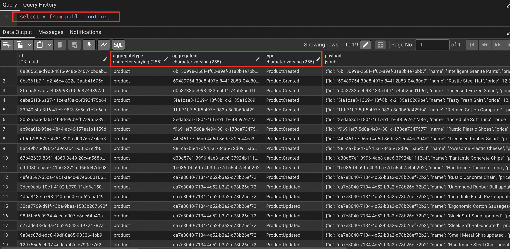
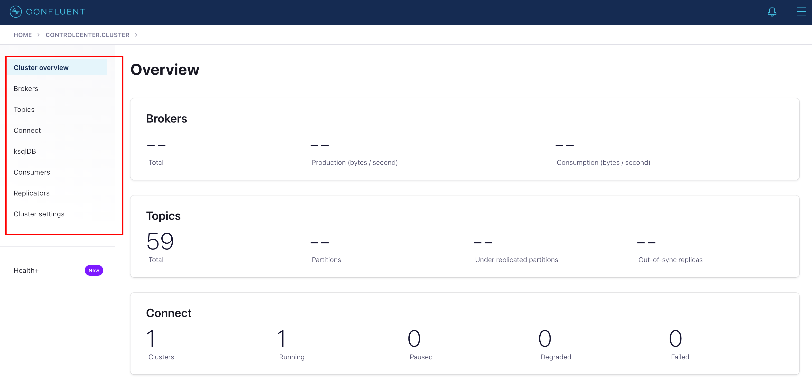
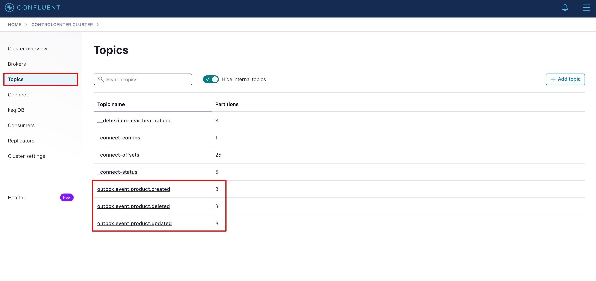
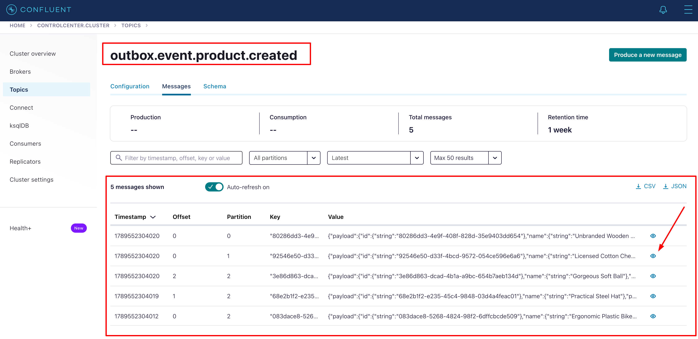
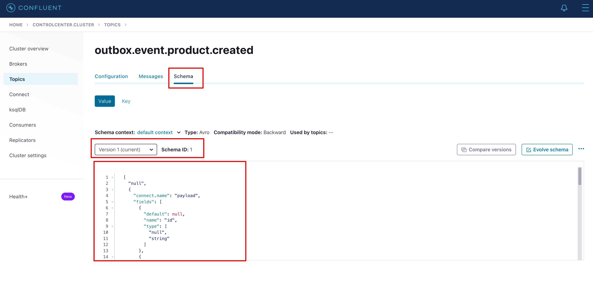

# Events Architecture Guide

> [!IMPORTANT]
> This guide is a work in progress.

Configurations, usage and other details will be updated as the project progresses.

## Overview

### Transactional Outbox Pattern with Unit of Work pattern

Domain changes and their events are written in the same database transaction via the Unit of Work, so a rollback never leaves a half-published event. The API only persists the aggregate and an outbox row; it never produces to Kafka. This is currently used for the product domain.

### CDC (Change Data Capture) with Debezium and Kafka

Debezium watches the outbox table after commit and publishes each event to a Kafka topic. Schema Registry (Avro) describes the message payload so consumers can read a stable schema.

## Local Setup and Configuration

### Setup

Migrations must be applied to the database before running the application.

```bash
make migrate
```

Start containers with `kafka` profile:

```bash
make start-kafka
```

### Debezium connector configuration

### Kafka configuration

### Schema registry configuration

There is no `.avsc` in the repo. The connector value is Avro (`AvroConverter` → `http://schema-registry:8081`); Connect infers the schema from the expanded outbox JSON and auto-registers it (default BACKWARD). The API only writes `ProductSchema` into the outbox — Connect is the producer, the Registry just versions what it gets.

## Usage

### Producing Outbox Events

> Currently it's only implemented for product domain.

Create/update or delete a product:

```bash
curl -sS -X POST 'http://localhost:8000/api/v1/products' \
  -H 'Content-Type: application/json' \
  -d '{
    "restaurant_id": "6e13f353-4f9e-4e22-b11c-2ba668fda528",
    "name": "Hambúrguer artesanal",
    "price": 29.99,
    "category_id": "095e1c0f-dec1-42cd-83c1-4a8cc6bd488a",
    "image_url": "https://example.com/product.jpg"
  }'
```

At the same unit of work, the product will be created/updated or deleted and the outbox event will be produced (created at `outbox` table).

The outbox table will be updated with the event data:

> [!NOTE] About the `outbox.type` column
> At screenshot below, you can see the `outbox.type` column on PascalCase format but was refactored to `model.action` on lower case (e.g. `product.created`, `product.updated`, `product.deleted`)



### Nagivate on Control Center

Access Control Center at `http://localhost:9021`



You can see the topics and their partitions, Kafka Connect, consumers, replicators, and others.

Topics screen:



### Events on topics

Go to messages screen to see the events on topics:



Example of message header on `outbox.event.product.created` topic:

```json
[
  {
    "key": "id",
    "value": "5449ba94-b5bc-420c-8d9f-2a10e651cdfb"
  },
  {
    "key": "eventType",
    "value": "product.created"
  }
]
```

Example of message payload on `outbox.event.product.created` topic:

```json
{
  "payload": {
    "id": {
      "string": "92546e50-d33f-4bcd-9572-054ce596e6a6"
    },
    "name": {
      "string": "Licensed Cotton Cheese"
    },
    "price": {
      "double": 12.3
    },
    "image_url": {
      "string": "http://placeimg.com/640/480"
    },
    "created_at": {
      "string": "2026-09-13T18:35:14.955897"
    },
    "updated_at": {
      "string": "2026-09-13T18:35:14.955902"
    },
    "category_id": {
      "string": "3ddd3703-6331-4a79-8af1-04bac779c519"
    },
    "restaurant_id": {
      "string": "2f8f4eb2-2202-4e31-a537-1c3f9706abf4"
    }
  }
}
```

You can check the Schema Registry for the message payload, it's versions, types and even evolve schema if needed.



### To improve message payload and/or Schema Registry
