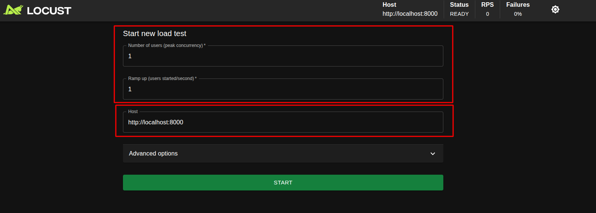
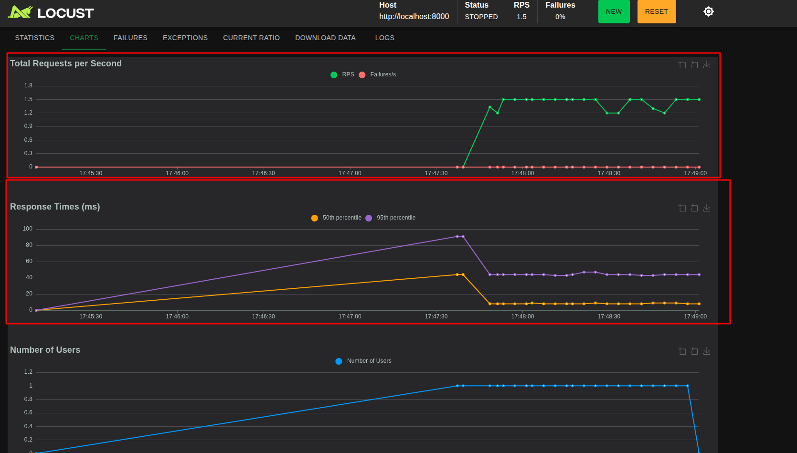

# Load Testing Guide

Proposed at [Add Load Tests ADR](../adr/005-add-load-tests.md)

## Overview

Uses Locust for load testing the API performance under different user loads.

## Running Load Tests

To run the load tests, run the following command:

```bash
make load-test
```

This will start Locust and you can access the web interface at `http://localhost:8089`.

You can defined the `peak concurrency` and `user spawn rate` as well as the host URL to be tested:



After starting the test, you will see real-time metrics about the requests, failures, response times, and number of users:


You can navigate to the `Charts` tab to see graphical representations of the metrics:



## Tips

### Recommended test parameters

- `peak concurrency`: 100 users
- `user spawn rate`: 10 users/second

### Use monitoring profile

Make sure the API and monitoring services (Prometheus and Grafana) are running before starting the load tests to monitor the performance effectively. You can start them using:

```bash
make start-monitoring
```

Use the [Monitoring Guide](./monitoring.md) to access Prometheus and Grafana dashboards to analyze the performance metrics during the load tests.

### Check logs and other tabs

It's recommended to log failures at created `TaskSet` on `locust/tasks/` directory, so you can analyze if there are any failures during the load tests by checking `Logs` tab or terminal logs.

Pay attention to other tabs on Locust web interface, such as `Failures` and `Exceptions` at Locust UI to get more insights into the load test results.

## Load Tests directory structure

The load tests are defined in the `locust` directory. The main file is `locust/locustfile.py`, which imports task sets from the `locust/tasks` directory.

The endpoints being tested are defined in the `locust/tasks` directory, where each API endpoint has its own task set simulating real-world usage patterns.

## Creating a new test scenario

The tasks sets are defined as classes that inherit from `TaskSet` in the `locust/tasks/` directory. Each class contains methods decorated with `@task` to define the actions to be performed during the load test.

Create a new Python file in the `locust/tasks/` directory, e.g., `some_endpoint_or_context_task_set.py`.

Define a new class that inherits from `TaskSet` and implement the desired tasks.

Base example is for categories endpoint at `locust/tasks/categories_task_set.py`:

Then add the new TaskSet at `tasks` list on `locust/locustfile.py`:

```python
class RafoodAPILoadTest(HttpUser):
	tasks = [
		...,
		# Add your new TaskSet here
	]
	host = 'http://localhost:8000'
	wait_time = between(1, 3)
```
