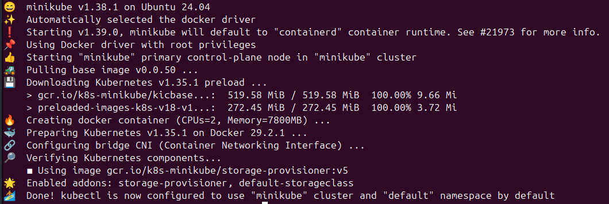
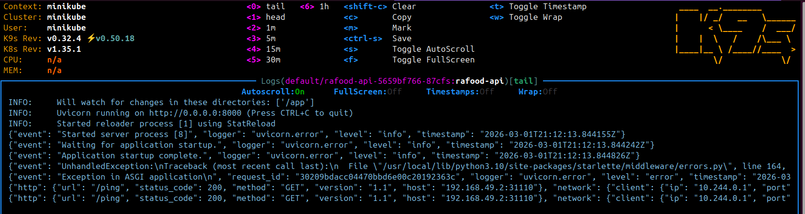
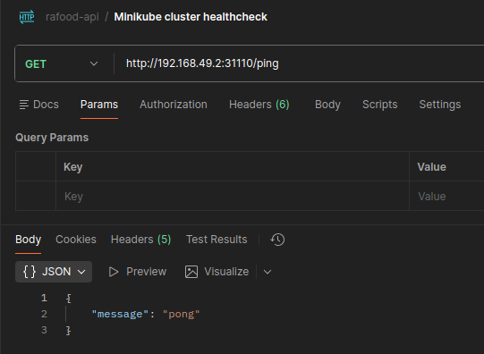

# Local Deployment with Kubernetes

## Setup

#### Requirements

Must have Docker installed and running on your machine.

#### Install Minikube

[Minikube](https://minikube.sigs.k8s.io/docs/start/) is a tool that allows you to run Kubernetes locally. It creates a single-node Kubernetes cluster on your local machine, which is ideal for development and testing purposes. To install Minikube on Linux, you can use the following commands:

```bash
curl -LO https://storage.googleapis.com/minikube/releases/latest/minikube-linux-amd64
sudo install minikube-linux-amd64 /usr/local/bin/minikube
```

An alternative to Minikube is [Kind](https://kind.sigs.k8s.io/), which runs Kubernetes clusters in Docker containers.

#### Install `kubectl`

```bash
sudo snap install kubectl --classic
```

Useful commands for `kubectl`

```bash
kubectl get pods

kubectl get services

kubectl delete pods --all

kubectl delete services --all

kubectl delete deployments --all

kubectl logs -f <pod-name>
```

#### Start a new Minikube cluster

```bash
minikube start

minikube status

kubectl cluster-info
```

The start command output:



You can stop and delete the cluster with:

```bash
minikube stop
minikube delete
```

#### Extra: use k9s

[k9s](https://k9scli.io/) is a terminal-based UI to interact with your Kubernetes clusters. It provides an easy way to navigate and manage your Kubernetes resources.

After installing, you just need to run `k9s` on your terminal. Tips for using k9s:

- `k9s` — open the interactive interface
- Use arrow keys ↑ ↓ to navigate between resources
- `/` — filter by name
- `l` — view logs of the selected pod
- `s` — open a shell in the selected pod
- `:ns` — switch namespace
- `:deploy` — view deployments
- `:svc` — view services
- `esc` — go back to the previous screen
- `:q` — quit k9s

At the top of the screen, k9s shows quick key hints for each context.

## Basic service and deployment configuration example

> Reference: [Docker and Kubernetes for Local Deployment Using FastAPI](https://medium.com/@wrefordmessi/docker-and-kubernetes-for-local-deployment-using-fastapi-1c8df431ed95) - How-to with a FastAPI application, deployment and service configuration to expose the app (uses Minikube).

#### Pre requisites

The Docker image won't be at Docker Hub, so we must declare `imagePullPolicy: Never` in the deployment configuration and build the image inside the Minikube environment:

```bash
# If minikube has not started
minikube start

eval $(minikube docker-env)

make build-container

# Verify the image is built inside minikube
docker images | grep rafood-api

# Warning: you must return to default environment
eval $(minikube docker-env -u)
```

#### Deployment configuration

```yaml
apiVersion: apps/v1            # API group/version for workload resources (Deployment)
kind: Deployment               # Declares a controller that manages Pods via ReplicaSets
metadata:
  name: rafood-api             # Unique name of the Deployment within the namespace
  labels:
    app: rafood-api            # Labels used for organization and selection
spec:
  replicas: 2                  # Desired number of running Pods (horizontal scaling)
  selector:
    matchLabels:
      app: rafood-api          # Selects which Pods belong to this Deployment (must match template.labels)
  template:                    # Pod template that will be replicated
    metadata:
      labels:
        app: rafood-api        # Labels applied to created Pods
    spec:
      containers:
        - name: rafood-api     # Container name inside the Pod
          image: rafood-api:latest   # Container image (using 'latest' is not recommended in production)
          imagePullPolicy: Never     # Never pull image from registry (use local image only)
          ports:
            - containerPort: 8000    # Port exposed by the container (informational for the cluster)
          resources:
            limits:
              memory: "512Mi"        # Maximum memory allowed (exceeding → OOMKilled)
              cpu: "500m"            # Maximum CPU allowed (0.5 core)
            requests:
              memory: "256Mi"        # Minimum memory guaranteed for scheduling
              cpu: "250m"            # Minimum CPU guaranteed (0.25 core)
```

#### Service configuration

```yaml
apiVersion: v1                 # Core API group (Service belongs to core/v1)
kind: Service                  # Network abstraction to expose a set of Pods
metadata:
  name: rafood-api-service     # Unique Service name (creates stable internal DNS)
  labels:
    app: rafood-api            # Labels for organization
spec:
  selector:
    app: rafood-api            # Selects Pods with this label to receive traffic
  type: LoadBalancer           # Exposes Service externally via cloud load balancer (uses NodePort internally)
  ports:
    - protocol: TCP            # Transport protocol (default is TCP)
      port: 5000               # Port exposed by the Service inside the cluster
      targetPort: 8000         # Actual container port receiving traffic
      nodePort: 31110          # Fixed port exposed on each Node (default range 30000–32767)
```

#### Apply the configurations

```bash
kubectl apply -f kubernetes/deployment.yml
kubectl apply -f kubernetes/service.yml
```

To monitor the pods, you can use and check logs:

```bash
kubectl get pods
kubectl logs -f <pod-name>
```

Example output of `kubectl get pods`:

```bash
NAME                         READY   STATUS    RESTARTS   AGE
rafood-api-5659bf766-87cfs   1/1     Running   0          25m
rafood-api-5659bf766-bhqqj   1/1     Running   0          25m
```

Or use k9s to monitor the pods and logs in a more interactive way:



#### Access the service

To access the service, you can use the `minikube service` command, which will open the service in your default web browser:

```bash
minikube service rafood-api-service
```

This command will automatically open the URL where your service is exposed, allowing you to interact with your FastAPI application running in the Minikube cluster.

Calling health check on Postman:



#### Stopping the cluster

When you're done, you can stop the Minikube cluster:

> [!NOTE]
> The `stop` command will stop the cluster but keep it available for later use. You won't need to apply any configurations again.
> If you want to completely remove the cluster, you can use the `delete` command.

```bash
minikube stop
```
