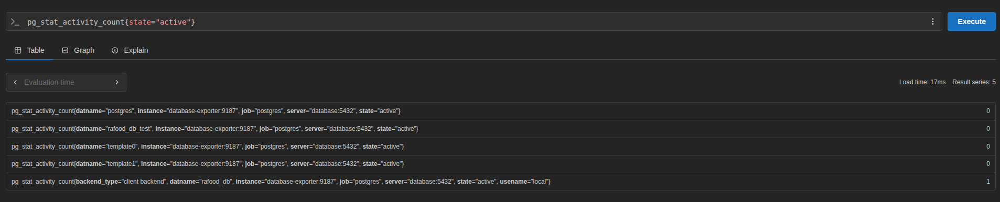
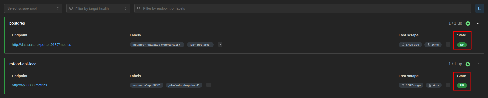
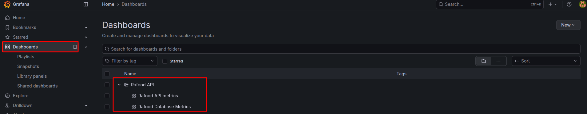

# Monitoring Guide

## Overview

Uses Prometheus and Grafana for monitoring the API performance and health.

## Setup and access

Start the containers using Docker Compose:

```bash
make start
```

This will start the API along with Prometheus and Grafana services.

For any changes on services, run:

```bash
make restart

# Or preferred
make restart-down
```

#### Prometheus

Access Prometheus at `http://localhost:9090` and by default, it scrapes metrics from the API at `http://api:8000/metrics`.

#### Grafana

Access Grafana at `http://localhost:3000` and the credentials are set in the `.env` file:

- Username: `GRAFANA_ADMIN_USER`
- Password: `GRAFANA_ADMIN_PASSWORD`

## Prometheus

#### Queries

To check the metrics, go to `http://localhost:9090/metrics` and start writing some function, operation, metric and label name to test it.



#### Targets

To check the targets, go to `http://localhost:9090/targets` and you should see all metrics sources. The status should be `UP`.



Those are the sources defined at `prometheus/prometheus.yml`.

## Grafana

#### Access dashboards

You can access dashboards at `Dashboards`, open the specific folder and open dashboard.



Those are the dashboards defined at `grafana/dashboards` as JSON files.
