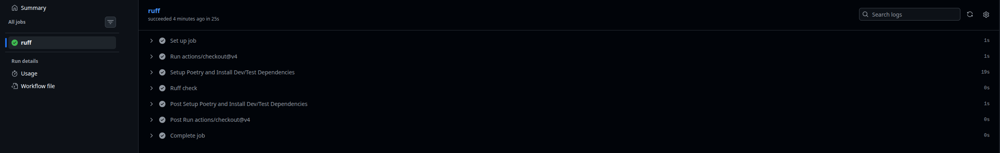
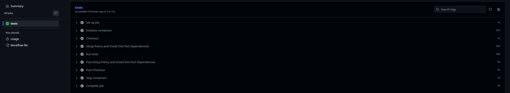
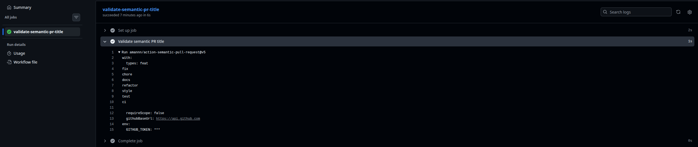
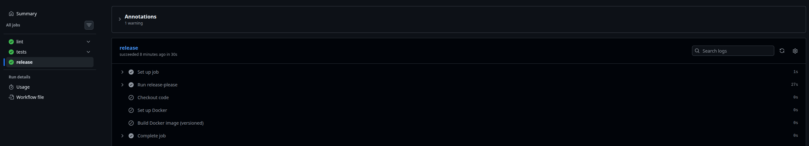
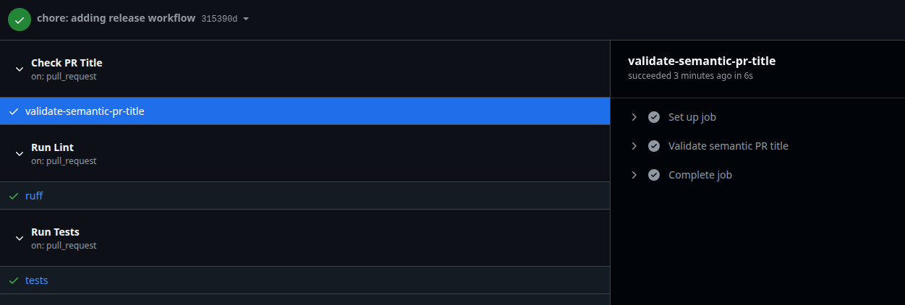
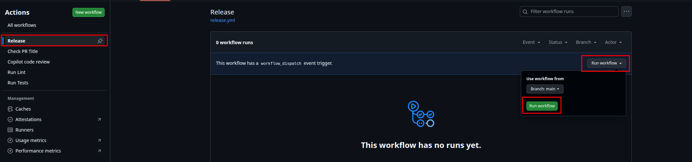
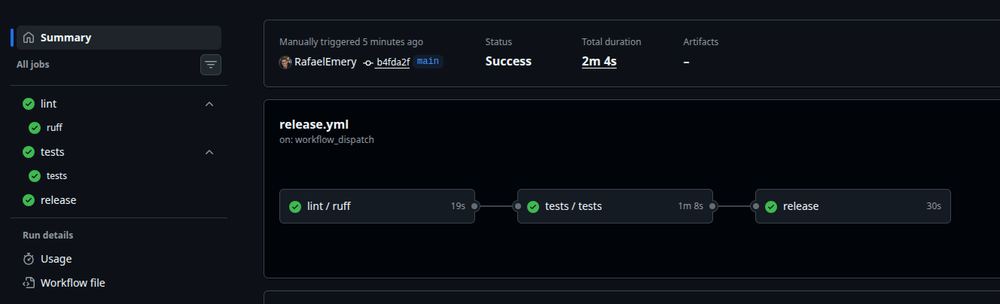
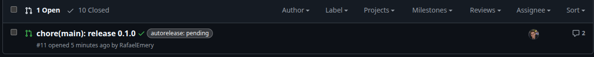
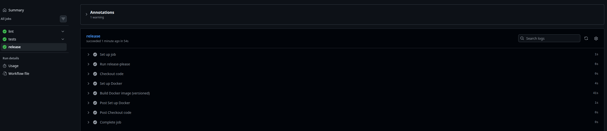

# Workflows Guide

## Overview

### `Lint & Type Check` Workflow

Uses `ruff` to check code style and linting issues across the codebase and `mypy` for type checking. It runs on pushes, pull requests to the `main` branch and can be called from another workflow.

### `Tests & Coverage Check` Workflow

Uses `pytest` to run the test suite, ensuring that all tests pass before code is merged. It runs on pushes, pull requests to the `main` branch and can be called from another workflow.

> [!TIP]
> It also checks the test coverage using `pytest-cov` and fails if the coverage is below **85%**.

### `Check PR Title` Workflow

Validates that pull request titles follow the conventional commit format. It runs on pull requests to the `main` branch and every time a PR is opened or updated.

Uses `amannn/action-semantic-pull-request` GitHub Action to enforce the commit message standards. The accepted types are: `feat`, `fix`, `chore`, `docs`, `style`, `refactor`, `test`, and `ci`.

### `Release` Workflow

Automates the release process by creating a tag and new release on GitHub and building a Docker image. It runs manually via the GitHub Actions interface.

Uses `Run Lint` and `Run Tests` workflows to ensure code quality before proceeding with the release. The release version is determined based on the conventional commit messages since the last release using `googleapis/release-please-action` ([GitHub repository and docs](https://github.com/googleapis/release-please-action)).

> [!NOTE]
> Uses semantic versioning and updates the version based on the commit types:
>
> - `feat`: minor version bump
> - `fix`: patch version bump
> - `BREAKING CHANGE` or `feat!`: major version bump

Uses a dedicated GitHub token stored in the repository secrets as `RELEASE_PLEASE_TOKEN` to create releases.

## Pull Request Workflows

The `Run Lint`, `Run Tests`, and `Check PR Title` workflows are configured to run automatically on pull requests to the `main` branch. This ensures that code quality checks and tests are performed before any changes are merged.

## Creating Releases

### Trigger `Release` Workflow (first time)

To start the release process, navigate to the `Actions` tab in your GitHub repository, select the `Release` workflow from the left sidebar, and click the `Run workflow` button.

The release workflow will execute the following steps:

> [!WARNING]
> At the first time, the `Release` workflow will not create a release directly and a Docker image. Instead, it will generate a Pull Request with the proposed version bump and changelog.

### Merge the Release Pull Request

Will create a Pull Request with the new version and changelog (`CHANGELOG.md`). After reviewing the changes, merge the PR to create the release.

A `chore(X.X.X): release X.X.X` commit will be added to the `main` branch. You can check the first release PR [here](https://github.com/RafaelEmery/rafood-api/pull/11).

### Trigger `Release` Workflow (second time)

You must trigger the release workflow on `Actions` again to **create the release and build Docker image**.

The release created:

There you go, you have successfully created a new release using GitHub Actions 🚀🚀🚀
